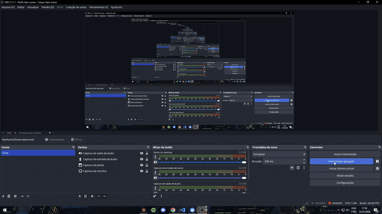

# NeuroSight

Sistema de **rastreamento ocular em Realidade Virtual** para o **Meta Quest Pro**: um app
nativo no headset grava para onde a pessoa olha dentro de uma cena 3D, e uma plataforma web
recebe as sessões, monta o vídeo e mostra o olhar sobre ele (heatmap em tempo real e modo de
validação).



## Estrutura

| Pasta | O que é | Stack |
|---|---|---|
| [`headset/`](headset/) | App do óculos: gaze → raycast → projeção 2D → captura de frames → `gaze.json` → upload | Unreal Engine 5.5, C++, OpenXR |
| [`web/`](web/) | API de ingestão + banco + montagem do MP4, e o viewer com heatmap | FastAPI, SQLAlchemy, PostgreSQL/SQLite, React + Vite + TS |

```
[Quest Pro — headset/]                   [Servidor — web/backend]               [Navegador — web/frontend]
 OpenXR: raio do olhar (~72–90 Hz)        FastAPI                                React
 ├─ raycast → ponto 3D + (u,v) 2D         ├─ create / frames / complete          ├─ lista de sessões
 ├─ captura da cena (30 fps, 1024²)       ├─ PostgreSQL (JSONB) + mídia em disco  ├─ vídeo + heatmap
 └─ botão B → upload em lotes ──HTTP──►   └─ MP4 (H.264) em background  ───────►  └─ modo validação
```

O contrato entre as duas metades é o `gaze.json` (`meta` + `frames[]` + `samples[]`),
documentado em [`headset/README.md`](headset/README.md#dados-gravados-por-sessão).

## Começando

**Clonar** (o Git for Windows já inclui o Git LFS; no Linux/WSL instale o `git-lfs`):

```bash
git lfs install
git clone git@github.com:joaozanini/NeuroSight.git
```

> Os assets do Unreal (`*.uasset`, `*.umap`) ficam no **Git LFS**. No Windows, prefira um
> caminho curto (ex.: `C:\GitHub\NeuroSight`): o empacotamento Android da Unreal é sensível
> ao limite de 260 caracteres de caminho.

- **App do headset:** abra `headset/EyeTrackingQuestPro.uproject` (UE 5.5). Setup, configurações
  críticas e empacotamento: [`headset/README.md`](headset/README.md) e
  [`headset/PASSO-A-PASSO.md`](headset/PASSO-A-PASSO.md).
- **Ambiente web (dev):** API em `web/backend` e site em `web/frontend`, veja
  [`web/README.md`](web/README.md). Para testar sem o óculos, use o simulador
  `web/scripts/device_simulator.py` (Fase 4) e os dados de exemplo do `python -m app.seed --demo`.
- **Servidor:** Docker Compose em `web/`, passo a passo em [`web/DEPLOY.md`](web/DEPLOY.md)
  (o servidor clona só a pasta `web/`, sem baixar os assets do Unreal).

## Documentação

- [`headset/docs/IC-RelatorioFinal/`](headset/docs/IC-RelatorioFinal/): relatório final da IC
- [`web/APRESENTACAO-ORIENTADOR.md`](web/APRESENTACAO-ORIENTADOR.md): visão técnica do sistema
- [`web/docs/demo-ambiente-web.mp4`](web/docs/demo-ambiente-web.mp4): vídeo de demonstração (1 min)

## Histórico

Este repositório unifica os antigos `QuestPro-EyeTracking` (app) e `QuestPro-EyeTracking-Web`
(web), com o histórico de commits dos dois preservado em `headset/` e `web/`. Na importação, o
`StarterContent` do Unreal (642 MB, não referenciado pela cena) foi removido, e os binários
do Unreal passaram para o Git LFS.
